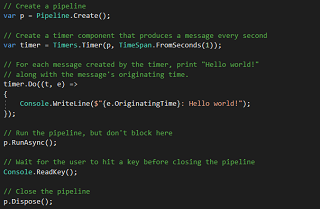
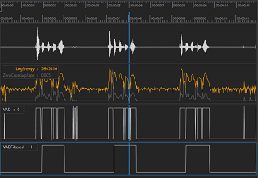
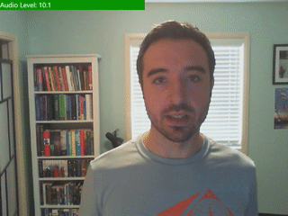
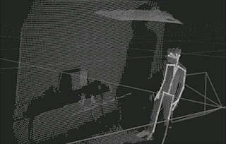
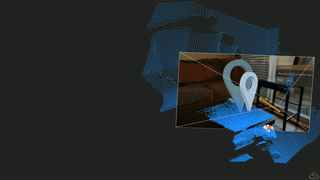

# Platform for Situated Intelligence Samples

This repository contains a few small example applications written with [Platform for Situated Intelligence](https://github.com/microsoft/psi). Some of the samples address specialized topics like how to leverage speech recognition components or how to bridge to ROS, but in general looking through them can give you more insight into programming with Platform for Situated Intelligence. Besides these samples, a good place to start reading about programming with \\psi is the [Brief Introduction](https://github.com/microsoft/psi/wiki/Brief-Introduction) and the set of [Tutorials](https://github.com/microsoft/psi/wiki/Tutorials).

As indicated in the last column in the table below, some of the samples have a corresponding detailed **walkthrough** that explains how the samples are constructed and function, and provide further pointers to documentation and learning materials. Going through these walkthroughs can also help you learn more about programming with \\psi.

| Name | Description | Windows | Linux | Walkthrough |
| :----------- | :---------- | :--: | :--: | :--: |
| [HelloWorld](Samples/HelloWorld)    | This sample is the simplest possible starting point for creating a \\psi application. | Yes | Yes | [Yes](Samples/HelloWorld) | 
| [SimpleVoiceActivityDetector](Samples/SimpleVoiceActivityDetector)    | This sample captures audio from a microphone and performs _voice activity detection_, i.e., it computes a boolean signal indicating whether or not the audio contains voiced speech. | Yes | Yes | [Yes](Samples/SimpleVoiceActivityDetector) | 
| [WebcamWithAudioSample](Samples/WebcamWithAudioSample)    | This sample illustrates how to display images from a camera and the audio energy level from a microphone. | Yes | - | [Yes](Samples/WebcamWithAudioSample) | 
| [LinuxWebcamWithAudioSample](Samples/LinuxWebcamWithAudioSample) | This sample illustrates how to display images from a camera and the audio energy level from a microphone on Linux. | - | Yes | [Yes](Samples/LinuxWebcamWithAudioSample) | 
| [AzureKinectSample](Samples/AzureKinectSample)    | This sample demonstrates how to use the Azure Kinect sensor with body tracking and how to use the `Join()` and `Pair()` operators to synchronize and fuse streams. | Yes | - | [Yes](Samples/AzureKinectSample) |
| [WhatIsThat](Samples/WhatIsThat)    | This sample implements a simple application that uses an Azure Kinect sensor to detect the objects a person is pointing to. | Yes | - | [Yes](Samples/WhatIsThat) |
| [PsiBot](https://github.com/microsoftgraph/microsoft-graph-comms-samples/tree/master/Samples/PublicSamples/PsiBot)    | This sample application shows how you can integrate \\psi with the Teams bot architecture to develop bots that can participate in live meetings. | Yes | - | [Yes](https://github.com/microsoftgraph/microsoft-graph-comms-samples/tree/master/Samples/PublicSamples/PsiBot) |
| [KinectSample](Samples/KinectSample) | This sample illustrates how to augment an existing voice activity detector by leveraging information about lips motion extracted from Kinect face tracking. | Yes | - | - |
| [SpeechSample](Samples/SpeechSample) | This sample illustrates how to use various speech recognition components. | Yes | - | - |
| [LinuxSpeechSample](Samples/LinuxSpeechSample) | This sample illustrates how to use various speech recognition components on Linux. | - | Yes | [Yes](Samples/LinuxSpeechSample) |
| [RosTurtleSample](Samples/RosTurtleSample)    | This sample illustrates how to connect Platform for Situated Intelligence to the `turtlesim` in ROS. | Yes | Yes | [Yes](Samples/RosTurtleSample) |
| [RosArmControlSample](Samples/RosArmControlSample) | This sample illustrates how to connect Platform for Situated Intelligence to control the [uArm Metal](http://ufactory.cc/#/en/uarm1) using ROS. | Yes | Yes | [Yes](Samples/RosArmControlSample) |
| [OpenCVSample](Samples/OpenCVSample) | This sample illustrates how to interop with OpenCV. | Yes | - | - |
| [HoloLensSample](Samples/HoloLensSample)    | This sample demonstrates how to develop Mixed Reality \\psi applications for the HoloLens 2. | UWP | - | [Yes](Samples/HoloLensSample) |

# Building

To build the samples, you will need to install [Visual Studio 2022](https://visualstudio.microsoft.com/vs/) with the .NET desktop development workload on Windows, or [.NET](https://docs.microsoft.com/en-us/dotnet/core/install/linux) on Linux. Some samples may have additional prerequisites. Please see the README of each individual sample for more information.

# Contributing

This project welcomes contributions and suggestions.  Most contributions require you to agree to a
Contributor License Agreement (CLA) declaring that you have the right to, and actually do, grant us
the rights to use your contribution. For details, visit https://cla.opensource.microsoft.com.

When you submit a pull request, a CLA bot will automatically determine whether you need to provide
a CLA and decorate the PR appropriately (e.g., status check, comment). Simply follow the instructions
provided by the bot. You will only need to do this once across all repos using our CLA.

This project has adopted the [Microsoft Open Source Code of Conduct](https://opensource.microsoft.com/codeofconduct/).
For more information see the [Code of Conduct FAQ](https://opensource.microsoft.com/codeofconduct/faq/) or
contact [opencode@microsoft.com](mailto:opencode@microsoft.com) with any additional questions or comments.

# License

All Platform for Situated Intelligence samples are available under an [MIT License](LICENSE.txt).

# Trademarks

This project may contain trademarks or logos for projects, products, or services. Authorized use of Microsoft trademarks or logos is subject to and must follow [Microsoft's Trademark & Brand Guidelines](https://www.microsoft.com/en-us/legal/intellectualproperty/trademarks/usage/general). Use of Microsoft trademarks or logos in modified versions of this project must not cause confusion or imply Microsoft sponsorship. Any use of third-party trademarks or logos are subject to those third-party's policies.
