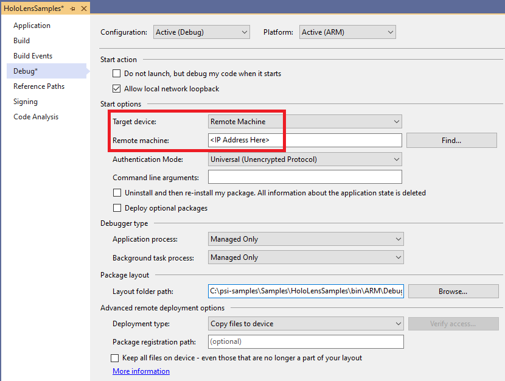
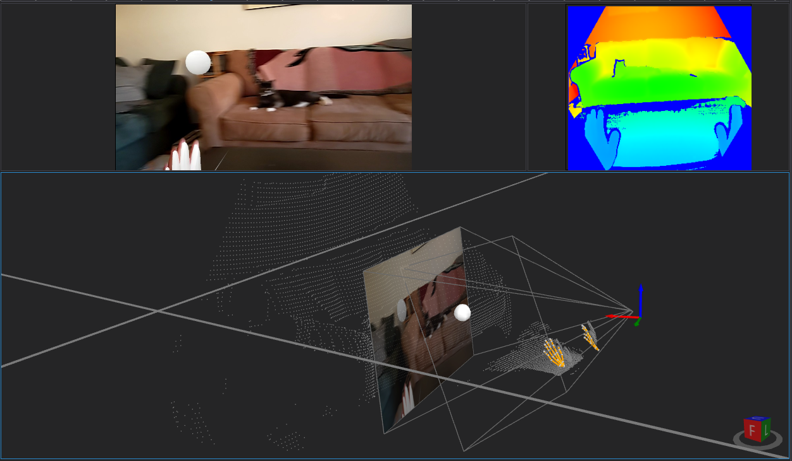

Platform for Situated Intelligence supports the development of mixed reality applications, from processing the rich multimodal sensor streams to rendering output on the device. For more information on the relevant concepts and components, see the [mixed reality overview](https://github.com/microsoft/psi/wiki/Mixed-Reality-Overview).

This sample project includes some simple demonstrations of how to develop HoloLens 2 applications powered by \\psi.

## Prerequisites

You will need a HoloLens 2. If you don't have a physical device, the [HoloLens 2 Emulator](https://docs.microsoft.com/en-us/windows/mixed-reality/develop/advanced-concepts/using-the-hololens-emulator) might work as well, but this has not been fully tested.

### Enable Developer Mode and the Device Portal

Follow [these steps](https://docs.microsoft.com/en-us/windows/mixed-reality/develop/platform-capabilities-and-apis/using-the-windows-device-portal) to enable Developer Mode and ensure you are able to use the Device Portal, as well as set yourself up for WIFi or USB access (USB is optional).

You can then try to connect to the HoloLens 2 device over WiFi by using its IP address, and access the device portal. You will have to setup a username/password by requesting a PIN which will be displayed on the HoloLens 2.

### Enable Research Mode

[Research Mode](https://docs.microsoft.com/en-us/windows/mixed-reality/develop/advanced-concepts/research-mode) is required for accessing data from the IMU sensors, visible light cameras, and depth cameras (including IR). Follow [these steps](https://docs.microsoft.com/en-us/windows/mixed-reality/develop/platform-capabilities-and-apis/research-mode#enabling-research-mode-hololens-1st-gen-and-hololens-2) to enable research mode on the device.

## Building and Deploying

Building and deploying this sample as an application that can run on the HoloLens 2 device is most easily done using Visual Studio.

### Building

Follow [these steps to install required mixed reality build tools](https://docs.microsoft.com/en-us/windows/mixed-reality/develop/install-the-tools). In particular, make sure you have the following installed in Visual Studio:
* Workload:
  * _Universal Windows Platform (UWP) development_
* Individual components:
  * _MSVC v143 - VS 2022 C++ ARM64 build tools (Latest)_
  * _C++ Universal Windows Platform support for v143 build tools (ARM64)_

NOTE: Later on, Visual Studio may at some point prompt you to also install the _C++ (v143) Universal Windows Platform tools_. Go ahead and install them when prompted.

### Deploying and Running

Connect your HoloLens 2 and your development machine to the same network (they can also be connected via USB). In the HoloLens 2, determine and write down its IP address (the easiest way to do this is to simply speak "What is my IP address?" while wearing the device with the Start menu visible).

In Visual Studio, right-click the `HoloLens Samples (Universal Windows)` project in the Solution Explorer, and select "Properties" at the bottom.

Select _Remote Machine_ for the _Target device_, and enter the HoloLens device's IP address for _Remote machine_.



Now simply hit F5 to build and deploy to the HoloLens 2. After deploying it once, you can also find the sample in the list of Apps installed on the device.

## Walkthrough

This project contains three sample Psi applications which can all be found in `Program.cs`. In `Main()`, you will see some initialization code at the top, and then some logic for using [StereoKit](https://stereokit.net/) to create UI holograms for starting/stopping each demo pipeline separately.

Let's walk through the "Bees Demo." In this demo, we'll utilize streaming information about the user's head pose, and render a "bee" (small sphere) buzzing around their head (using spatial audio).

First we create our \\psi `Pipeline` as normal:

```csharp
var pipeline = Pipeline.Create(nameof(BeesDemo));
```

Attached to the project is a short audio clip of buzzing bees. We'll generate a continuous \\psi stream of `AudioBuffer` from this file using the `WaveStreamSampleSource` component, and pipe it to a `SpatialSound` component for rendering the audio from a particular location (determined later).

```csharp
// Load bee audio from a wav file, triggered to play every two seconds.
using var beeWave = Assembly.GetCallingAssembly().GetManifestResourceStream("HoloLensSample.Assets.Sounds.Bees.wav");
var beeAudio = new WaveStreamSampleSource(pipeline, beeWave);
var repeat = Generators.Repeat(pipeline, true, TimeSpan.FromSeconds(2));
repeat.PipeTo(beeAudio);

// Send the audio to a spatial sound rendering component.
var beeSpatialSound = new SpatialSound(pipeline, default, 2);
beeAudio.PipeTo(beeSpatialSound);
```

We'll use the `HeadSensor` component to get the continuous input stream of the user's head pose. Then we use a `Select` operator to derive a new stream for the bee's pose. Inside the operator, we calculate the desired pose of the bee for every pose of the user's head, over time.

```csharp
// Calculate the pose of the bee that flies in a 1 meter radius circle around the user's head.
var oneMeterForward = CoordinateSystem.Translation(new Vector3D(1, 0, 0));
var zeroRotation = DenseMatrix.CreateIdentity(3);
var headPose = new HeadSensor(pipeline);
var beePose = headPose.Select((head, env) =>
{
    // Fly 1 degree around the user's head every 20 ms.
    var timeElapsed = (env.OriginatingTime - pipeline.StartTime).TotalMilliseconds;
    var degrees = Angle.FromDegrees(timeElapsed / 20.0);

    // Ignore the user's head rotation.
    head = head.SetRotationSubMatrix(zeroRotation);
    return oneMeterForward.RotateCoordSysAroundVector(UnitVector3D.ZAxis, degrees).TransformBy(head);
});
```

Finally, we'll use the `MeshStereoKitRenderer` component to render a yellow sphere for representing the bee, and pass the bee's pose to it. We'll also pass the bee's position (rotation not needed) to the `SpatialSound` component we created earlier.

```csharp
// Render the bee as a sphere.
var sphere = new MeshStereoKitRenderer(pipeline, Mesh.GenerateSphere(0.1f), Color.Yellow);
beePose.PipeTo(sphere.PoseInput);

// Finally, pass the position (Point3D) of the bee to the spatial audio component.
var beePosition = beePose.Select(b => b.Origin);
beePosition.PipeTo(beeSpatialSound.PositionInput);
```

## Persisting Stores

It is also possible to persist any of our \\psi application's streams to a store on the device. We could then use the [Device Portal](https://docs.microsoft.com/en-us/windows/mixed-reality/develop/platform-capabilities-and-apis/using-the-windows-device-portal) to copy that store to a Windows dev machine for visualizing in [Psi Studio](https://github.com/microsoft/psi/wiki/Psi-Studio).

An example of how to accomplish this can be found in the `CreateStoreWithSourceStreams()` method in this sample project.

One location that is easy to access for writing data is the application's "LocalState" folder. For example, you can find that folder for this sample application in the Device Portal at the path: __LocalAppData\HoloLensSample\LocalState__

You can create a \\psi store at that location with the following line of code:

```csharp
var store = PsiStore.Create(pipeline, storeName, ApplicationData.Current.LocalFolder.Path);
```

Streams can then be persisted to that store as normal. For example:

```csharp
var hands = new HandsSensor(pipeline);
hands.Left.Write("Hands.Left", store);
hands.Right.Write("Hands.Right", store);
```

Note: The visualizer for hand tracking data is defined in `Microsoft.Psi.MixedReality.Visualization.Windows`. The visualizers for 3D depth and image camera views are defined in `Microsoft.Psi.Spatial.Euclidean.Visualization.Windows`. Follow the instructions for [3rd Party Visualizers](https://github.com/microsoft/psi/wiki/3rd-Party-Visualizers) to add those projects' assemblies to `PsiStudioSettings.xml` in order to visualize 3D hands and camera views in PsiStudio. 

Here's an example visualization of streams persisted by the "Bees Demo":


