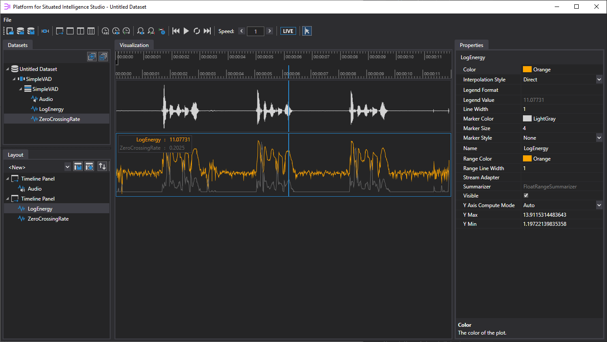
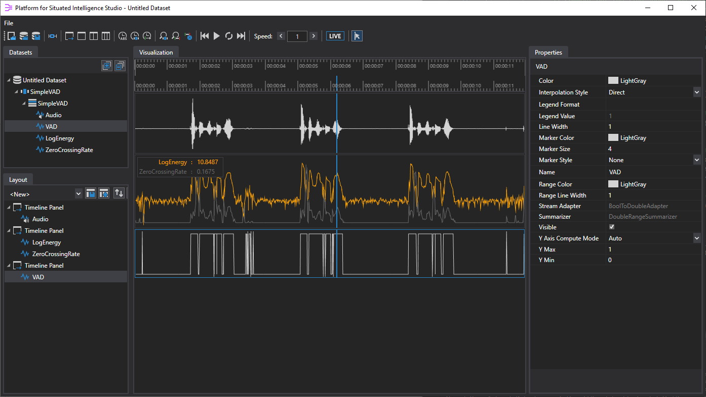
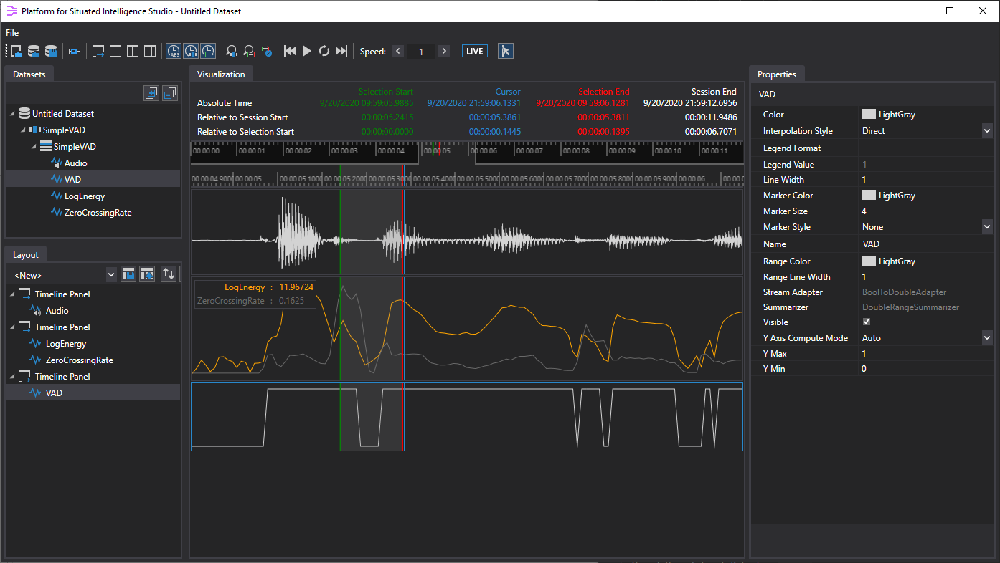
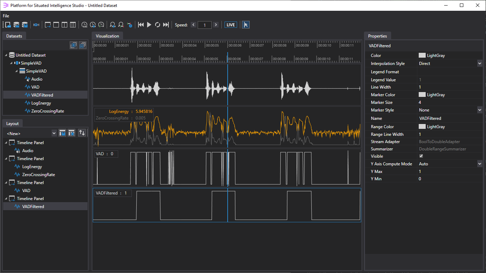

# Simple Voice Activity Detector

This sample application captures audio from a microphone and performs _voice activity detection_, i.e., it computes a boolean signal indicating whether or not the audio contains voiced speech. While the sample uses a very simple, naive, and not very robust approach for voice activity detection, its primary purpose is to walk you through a basic example of a \\psi application, and introduce some of the basic concepts around instantiating components, wiring them together, persisting data, replaying from data stores, and tuning your applications. For best results, we recommend using a headset microphone when running, testing, and tuning this sample code in your own environment.

The sample includes the following aspects:
1. Setting up a basic application pipeline,
2. Instantiating and connecting microphone and acoustic feature extractor components,
3. Executing a live pipeline and persisting results to disk,
4. Visualizing the results in Platform for Situated Intelligence Studio,
5. Using stream operators to compute and filter a voice activity stream, and
6. Replaying from persisted data and visualizing results again to iteratively tune the application.

Following these instructions step-by-step, you will end up constructing the sample from scratch, learning several important concepts along the way. We recommend before perusing this walkthrough to read the [Brief Introduction](https://github.com/microsoft/psi/wiki/Brief-Introduction) tutorial, which introduces some of the fundamental aspects of \\psi.

If anything is unclear in the walkthrough below, or if you find an error, please don’t hesitate to file a GitHub issue to let us know.

## Setting up the project

To build \\psi applications, we recommend using [Visual Studio 2019](https://www.visualstudio.com/vs/ "Visual Studio 2019") on Windows (the free, Community Edition is sufficient). Under Linux, we recommend using [Visual Studio Code](https://code.visualstudio.com/). We will build this sample application using the available [\\psi Nuget packages](https://github.com/microsoft/psi/wiki/Using-via-NuGet-Packages). 

### Steps for Windows

Follow these steps to set up the Visual Studio project on Windows:

1. First, create a simple .NET Core console app by going to _File -> New Project -> Visual C# -> Console App (.NET Core)_.

2. Add references to a couple \\psi NuGet packages. You can do so by going to References (under your project), right-click, then _Manage NuGet Packages_, then go to _Browse_. Make sure the _Include prerelease_ checkbox is checked, as \\psi packages are still in beta, pre-release versions. Look for the following packages and install them:
- `Microsoft.Psi.Runtime`: provides core \\psi infrastructure
- `Microsoft.Psi.Audio.Windows`: provides audio components and APIs

### Steps for Linux

In Linux, we'll will use the `dotnet` command-line tool to create the initial project and Program.cs, and add the NuGet packages we need:
- `Microsoft.Psi.Runtime`: provides core \\psi infrastructure
- `Microsoft.Psi.Audio.Linux`: provides audio components and APIs

The commands are:
```bash
$ dotnet new console -n SimpleVoiceActivityDetector && cd SimpleVoiceActivityDetector
$ dotnet add package Microsoft.Psi.Runtime --version=0.13.32.2-beta
$ dotnet add package Microsoft.Psi.Audio.Linux --version=0.13.32.2-beta
```

Note that due to an issue with NuGet, you'll need to specify the exact version of the NuGet package you wish to install, otherwise you will get a really old version. It's advised to specify the latest version that we have released.

## Setting up the application pipeline

Let's start with a few `using` directives

```csharp
using System;
using System.IO;
using System.Linq;
using Microsoft.Psi;
using Microsoft.Psi.Audio;
```

\\psi applications consist of pipelines of components connected to each other via streams of data. So the first thing we have to do is create the pipeline. This can be done easily via a factory method called `Pipeline.Create()`, which we can invoke to get a pipeline object. To run it, we can simply use the `Run()` method, or its non-blocking version, `RunAsync()`. We can then wait until the user hits a key with `Console.ReadKey()`, before stopping the pipeline, which is accomplished by calling the `Dispose()` method (we don't need to explicitly invoke `Dispose()` when the `using` pattern is utilized, as `Dispose()` is implicitly called at the end of the block):

```csharp
public static void Main()
{
    using (var p = Pipeline.Create())
    {
        p.RunAsync();
        Console.ReadKey();
    }
}
```

## Adding microphone and acoustic feature components

At this point the pipeline is empty, so now let's add some components.

The following lines of code create a microphone and an acoustic feature extractor and connect them together. The first line creates the microphone by creating a new instance of the `AudioCapture` component class. Every time you instantiate a component in \\psi, you have to pass it the pipeline object that it belongs to. This component also takes a configuration parameter specifying the audio format. In this case, the format parameter specifies that the component should generate audio at 16Khz, on 1 channel, in a 16 bit PCM format.

The third line connects the two together by using the `PipeTo` method. All components can have any number of _emitters_ for streaming output, and any number of _receivers_ for streaming input. In this case, the `AudioCapture` component implements the `IProducer<AudioBuffer>` interface, guaranteeing that it produces an `AudioBuffer` stream on an emitter called `Out`. Similarly, the `AcousticFeatureExtractor` component implements the `IConsumer<AudioBuffer>` interface, guaranteeing that it consumes an `AudioBuffer` stream in a receiver called `In`.

```csharp
using (var p = Pipeline.Create())
{
    // Create the microphone, acoustic feature extractor, and connect them
    var microphone = new AudioCapture(p, WaveFormat.Create16kHz1Channel16BitPcm());
    var acousticFeaturesExtractor = new AcousticFeaturesExtractor(p);
    microphone.Out.PipeTo(acousticFeaturesExtractor.In);

    p.RunAsync();
    Console.ReadKey();
}
```

The `PipeTo` operator knows to connect `.Out` of an `IProducer` to `.In` of an `IConsumer` when the emitter and receiver are not explicitly specified, allowing us to simplify the code above to make it slightly more readable:

```csharp
microphone.PipeTo(acousticFeatureExtractor);
```

Before running this pipeline, let's print some information to the console so we see something happening when we run the application. \\psi has a set of [basic stream operators](https://github.com/microsoft/psi/wiki/Basic-Stream-Operators) that work over generic streams, such as `Select()`, `Do()`, `Where()` and so forth. Let's apply the `Do()` operator to the `LogEnergy` output stream of the acoustic feature extractor, which executes a function for each message posted on the stream. In this case, we'll simply print the value of each message to the console.

```csharp
// Create the microphone, acoustic feature extractor, and connect them
var microphone = new AudioCapture(p, WaveFormat.Create16kHz1Channel16BitPcm());
var acousticFeaturesExtractor = new AcousticFeaturesExtractor(p);
microphone.PipeTo(acousticFeaturesExtractor);

// Display the log energy
acousticFeaturesExtractor.LogEnergy
    .Do(logEnergy => Console.WriteLine($"LogEnergy = {logEnergy}"));
```

Let's now execute the application. You should notice that the values printed will be low when you're quiet, and get higher when you talk. But the messages will be flowing by very fast, as the microphone will produce an audio buffer message every 10 ms or so.

So let's slow things down by inserting a `Sample()` operator to sample and return a message only every 0.2 seconds. \\psi provides a number of built-in stream operators for [interpolation and sampling](https://github.com/microsoft/psi/wiki/Interpolation-and-Sampling).

```csharp
// Display the log energy
acousticFeaturesExtractor.LogEnergy
    .Sample(TimeSpan.FromSeconds(0.2))
    .Do(logEnergy => Console.WriteLine($"LogEnergy = {logEnergy}"));
```

Run the application again, and you should see messages being printed more slowly (5 per second). You should still observe that the values are high when you speak and lower when you are quiet.

## Persisting streams to disk

Next we'll see how to persist streams to disk and how to visualize them. Data logging is key in many applications, and \\psi makes that very easy. The first thing we'll need to do is create a __store__ to which streams will be logged. We can create a store using the `PsiStore.Create()` factory method like so:

```csharp
var store = PsiStore.Create(p, "SimpleVAD", Path.Combine(Directory.GetCurrentDirectory(), "Stores"));
```

In addition to the pipeline object, the method takes in parameters for the desired name of the store, as well as where it will be located on disk. Here we specified a folder called "Stores" inside the current directory to create the stores in.

Specifying which streams we'd like to persist to the store is very simple. Let's try persisting the microphone's audio stream, as well as two of the output streams from the acoustic feature extractor. We use the stream operator `Write()`, and we specify names for these streams.

```csharp
microphone.Write("Audio", store);
acousticFeaturesExtractor.LogEnergy.Write("LogEnergy", store);
acousticFeaturesExtractor.ZeroCrossingRate.Write("ZeroCrossingRate", store);
```

Let's run the sample again. The output should look the same, but this time we have data being written to disk as the application runs. If you now navigate to the folder you specified in the `PsiStore.Create` method, you should see a new folder called __SimpleVAD.0000__, inside of which are a few files that together comprise the newly created \\psi store. Every time you run the application, a new store will be created in a new folder with an incremented number, e.g., __SimpleVAD.0001__, __SimpleVAD.0002__, and so on.

The persistence system in \\psi is optimized for throughput, and you will see multiple files in a store like this, including data, index, and catalog files.

## Visualizing the basic streams

Our goal here is to inspect the data we just persisted and figure out a good `LogEnergy` value that separates speech from non-speech. We'll use the Platform for Situated Intelligence Studio (in short PsiStudio) tool to do this. As PsiStudio does not currently ship as a binary, you will have to build the tool from the codebase -- here are the [instructions](https://github.com/microsoft/psi/wiki/Building-the-Codebase). The tool includes a number of visualizers for common data types.

That data we've just persisted might show up in PsiStudio as follows:



In order to create a visualization like the one above:
* Open the newly created store by clicking the __Open Store__ button and navigating to the newly created folder with your store. You can click any of the files in the folder, as PsiStudio will figure out that they all go together to comprise the store.
* You should see three streams in the __Datasets__ tab to the left: `Audio`, `LogEnergy`, and `ZeroCrossingRate`. Click and drag each of the streams from the left into the visualization container in the middle. Drag `Audio` into open space, drag `LogEnergy` into the open space below the audio visualization, and then drag `ZeroCrossingRate` _on top_ of the `LogEnergy` visualization.
* The _Layout_ tab on the left-hand side shows the various panels and visualizers they each contain. You can click on any of the visualizers (or panels) and set various properties for it in the _Properties_ panel on the right-hand side. Select the `ZeroCrossingRate` visualizer in the _Layout_ tab and then change its color  in the _Properties_ tab to DimGray. Then select the `LogEnergy` visualizer and change its color to Orange.
* Finally, in order to inspect the `LogEnergy` values in the bottom timeline panel, we need to turn on the legend by right-clicking the panel and selecting _Show Legend_. You will notice that as you move the time cursor left and right with the mouse, the legend automatically updates to show the value of the stream at the selected time. 

As I navigate around my collected data, it appears that the `LogEnergy` stream takes on values around 10 or 11 when I am speaking, and values around 5 when I am not speaking. Therefore, a good value for distinguishing speech from non-speech might be 7. This number may be different for you depending on your microphone, background noise level, etc.

Before getting back to the code, it's important to note that PsiStudio lets you persist and later reuse the visualization layouts you have created. To save the current layout, simply click on the save button (first button) next to the drop-down list in the _Layout_ tab. A dialog box will pop-up asking you to name the layout. Let's call it 'SimpleVAD'. Next time you open PsiStudio this layout will be available in the drop-down list, and you can simply select it to bring back all these visualizers, in the current configuration.

## Creating the VAD stream

To create the voice activity stream, we're going to use another stream operator called `Select()` that allows us to transform a stream by applying a function to each message in the stream. Let's use a function that returns __true__ if the LogEnergy is greater than 7. We'll also persist the resulting boolean stream to the store under the name "VAD".

```csharp
// Create a voice-activity stream by thresholding the log energy
var vad = acousticFeaturesExtractor.LogEnergy
    .Select(l => l > 7);
...
vad.Write("VAD", store);
```

To actually generate a VAD stream, we could either run the application live again and speak into the microphone as we did before, or we could use the powerful _replay_ functionality of \\psi to run this modified pipeline over the data we had already collected. This is an important strategy for these kinds of systems. We often want to re-run many times in a row over the same data, iteratively adjusting and tuning parameters and observing how the application responds and performs.

In this example, all we need to do is replace the line of code that creates the `microphone` stream from an `AudioCapture` component, to one that _reads_ the audio stream from the previously persisted store. To accomplish this, we first open the store by using the `PsiStore.Open` method, with arguments specifying the pipeline object, the name of the store, and its location. We then use the `OpenStream<T>` method on the store to open the stream called "Audio" that exists in the store. Note that we have to specify the type of messages on this stream, in this case `AudioBuffer`.

```csharp
// Create the microphone, acoustic feature extractor, and connect them
// var microphone = new AudioCapture(p, WaveFormat.Create16kHz1Channel16BitPcm());
var inputStore = PsiStore.Open(p, "SimpleVAD", Path.Combine(Directory.GetCurrentDirectory(), "Stores", "SimpleVAD.0000"));
var microphone = inputStore.OpenStream<AudioBuffer>("Audio");
var acousticFeaturesExtractor = new AcousticFeaturesExtractor(p);
microphone.PipeTo(acousticFeaturesExtractor);
```

Everything else in the code remains the same. Now when we run the application, we will again see LogEnergy results printed to the screen, but these are no longer being computed from the live microphone, but instead from the audio data we previously persisted. This data store is of course finite, and at some point the pipeline will run out of data (no more messages are displayed), at which point we can again strike any key and the pipeline will terminate. Upon completion, a new store will have been created, now called "SimpleVAD.0001".

## Visualizing the VAD stream

Back in PsiStudio, we can open our new store by clicking the __Open Store__ button and navigating to the newly created "SimpleVAD.0001" folder. You can once again click any of the files in this folder.



As we can see, the VAD signal seems to be mostly correct, but with many little fluctuations up and down corresponding to when the high-frequency, high-variance LogEnergy stream flickered across our selected threshold value (e.g., 7).

Let's try to filter out these fluctuations. The logic we'll aim for is to have the VAD signal switch from __false__ to __true__ only when it has been above the threshold for some span of time, and from __true__ to __false__ only when it has been below the threshold for a span of time. In order to determine how long that span of time should be, we'll need a rough estimate of the length of the fluctuations we're trying to filter out.

Let's use the scroll wheel to zoom closer into a segment of data. By clicking the three clock buttons at the top, in the PsiStudio toolbar, we'll see some additional timing information above the data. Let's shift-left-click and shift-right-click to define the start and end points of a selection interval around one of the fluctuations:



As we can see from the timing information, the __Selection End__ relative to the __Selection Start__ is about 140 ms. This tells us that the selection is about 140 ms wide. To be safe, let's use a time span of 300 ms when deciding whether we can safely switch the VAD output from __false__ to __true__ or vice versa. Let's go back to the code.

## Filtering the VAD signal

We'll use a couple of additional stream operators to filter the VAD stream (and persist to the store):

```csharp
// Create filtered signal by aggregating over historical buffers
var vadWithHistory = acousticFeaturesExtractor.LogEnergy
    .Window(RelativeTimeInterval.Future(TimeSpan.FromMilliseconds(300)))
    .Aggregate(false, (previous, buffer) => (!previous && buffer.All(v => v > 7)) || (previous && !buffer.All(v => v < 7)));

...
vadWithHistory.Write("VADFiltered", store);
```

You'll first notice the `Window()` operator, which buffers a window of messages, in this case over a future interval of 300 ms. \\psi provides a comprehensive set of stream operators that allow the developer to easily implement a variety of [stream windowing operations](https://github.com/microsoft/psi/wiki/Windowing-Operators).

The second operator we've added, `Aggregate()`, allows us to implement a stateful computation over its input, which in this case is the window of messages. In this operator, we must specify the initial value to output, in this case __false__, and then we must provide a function with two parameters: the previous value of the computation, and the current input (in this case a window buffer of LogEnergy values).

The function we've written above basically says that if the previous output was __false__, we output __true__ only if all the values in the buffer are above the threshold. Alternatively, if the previous output was __true__, then we can remain at __true__ only if it is _not_ the case that all the values in the buffer are below the threshold (in that case, we would switch to returning __false__).

Our final application looks like the following:

```csharp
public static void Main()
{
    using (var p = Pipeline.Create())
    {
        // Create the microphone, acoustic feature extractor, and connect them
        //var microphone = new AudioCapture(p, WaveFormat.Create16kHz1Channel16BitPcm());
        var inputStore = PsiStore.Open(p, "SimpleVAD", Path.Combine(Directory.GetCurrentDirectory(), "Stores", "SimpleVAD.0000"));
        var microphone = inputStore.OpenStream<AudioBuffer>("Audio");
        var acousticFeaturesExtractor = new AcousticFeaturesExtractor(p);
        microphone.PipeTo(acousticFeaturesExtractor);

        // Display the log energy
        acousticFeaturesExtractor.LogEnergy
            .Sample(TimeSpan.FromSeconds(0.2))
            .Do(logEnergy => Console.WriteLine($"LogEnergy = {logEnergy}"));

        // Create a voice-activity stream by thresholding the log energy
        var vad = acousticFeaturesExtractor.LogEnergy
            .Select(l => l > 7);

        // Create filtered signal by aggregating over historical buffers
        var vadWithHistory = acousticFeaturesExtractor.LogEnergy
            .Window(RelativeTimeInterval.Future(TimeSpan.FromMilliseconds(300)))
            .Aggregate(false, (previous, buffer) => (!previous && buffer.All(v => v > 7)) || (previous && !buffer.All(v => v < 7)));

        // Write the microphone output, VAD streams, and some acoustic features to the store
        var store = PsiStore.Create(p, "SimpleVAD", Path.Combine(Directory.GetCurrentDirectory(), "Stores"));
        microphone.Write("Audio", store);
        vad.Write("VAD", store);
        vadWithHistory.Write("VADFiltered", store);
        acousticFeaturesExtractor.LogEnergy.Write("LogEnergy", store);
        acousticFeaturesExtractor.ZeroCrossingRate.Write("ZeroCrossingRate", store);

        p.RunAsync();
        Console.ReadKey();
    }
}
```

Now let's run the application, again replaying over the store we originally collected live. When it's done, let's go back to PsiStudio.

## Visualizing the filtered VAD stream

Let's open the newly created store, which if you've been following along exactly should be called "SimpleVAD.0002". We can visualize the `VADFiltered` stream by dragging it below the `VAD` stream we previously visualized, as here:



As you can see, this signal looks a lot better, albeit still not quite perfect. As mentioned at the beginning, this example has been a highly simplistic way to build a voice activity detector, whereas building one that is more accurate, robust, and reliable can get quite a bit more complicated. However, hopefully this small example gives you a good sense about what programming with \\psi is like, and how to visualize and replay over persisted data to iteratively tune your applications.

For a slightly more complex sample that will walk you through some of other important features of \\psi, such as data fusion and synchronization, check out the WebcamWithAudio samples ([Windows](https://github.com/microsoft/psi-samples/tree/main/Samples/WebcamWithAudioSample) and [Linux](https://github.com/microsoft/psi-samples/tree/main/Samples/LinuxWebcamWithAudioSample) versions). Have fun!