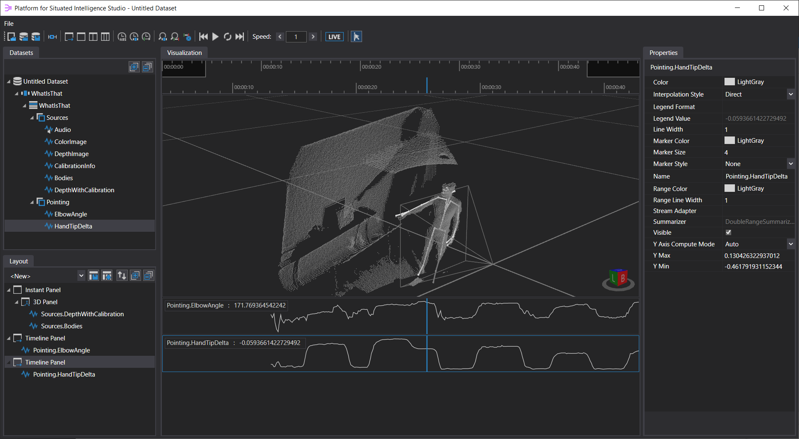

# What-Is-That

This sample implements a simple application that uses an Azure Kinect sensor to detect the objects a person is pointing to. When running, the application selects the closest body detected by Azure Kinect, determines if the person is pointing to an object (i.e., if their arm is extended out towards an object), computes the direction of pointing, intersects that with the depth map to determine the 3D target, projects this 3D point back into the Azure Kinect color camera, crops a region in the image around this point, and sends it to Azure Computer Vision service to perform object detection. In addition, a voice-activity-detector component runs over the audio captured from the microphone, and the speech segments are sent to Azure Speech Service for speech recognition. The various streams persisted by the application can be visualized in Platform for Situated Intelligence Studio. 

The sample is meant to illustrate how one can connect together a wide array of components, including an Azure Kinect sensor, Azure Cognitive Services for speech and vision, with custom, application-specific logic for spatial reasoning. The sample could be further extended to print or speak out the detected object.

# Requirements

This sample requires an Azure Kinect sensor, as well as subscription keys for the Azure Speech and Computer Vision services. The subscription keys need to be set in the static variables `AzureSpeechSubscriptionKey` and `AzureVisionSubscriptionKey` in the file `Constants.cs`.

Even if you do not have an Azure Kinect sensor, or the necessary Azure subscriptions, the walkthrough below can still be informative to learn about various aspects of the \\psi framework.

# Walkthrough

This walkthrough explains how the sample is constructed, and in the process illustrates a number of concepts and affordances in Platform for Situated Intelligence, including instantiating and connecting components, using delivery policies, synchronizing and fusing data streams, writing custom stream operators, and so on. Following these instructions step-by-step, you will end up constructing the sample from scratch, and learning about these concepts in the process. We recommend before perusing this walkthrough to read the [Brief Introduction](https://github.com/microsoft/psi/wiki/Brief-Introduction) tutorial, which introduces some of the main concepts in \\psi, or to look at some of the simpler samples first, such as the [webcam with audio sample](https://github.com/Microsoft/psi-samples/tree/main/Samples/WebcamWithAudioSample) or [Azure Kinect sample](https://github.com/microsoft/psi-samples/tree/main/Samples/AzureKinectSample).

## Creating the project

We begin by creating a new C# Console App project, targeting the .NET Framework 4.7.2, and we add the following nuget packages:

- `Microsoft.Psi.Runtime`: provides core \\psi infrastructure
- `Microsoft.Psi.Audio.Windows`: provides audio components and APIs
- `Microsoft.Psi.AzureKinect.x64`: provides Azure Kinect components
- `Microsoft.Psi.CognitiveServices.Speech`: provides components for access to Azure Cognitive Services Speech APIs.
- `Microsoft.Psi.CognitiveServices.Vision`: provides components for access to Azure Cognitive Services Vision APIs.
- `Microsoft.Psi.Imaging.Windows`: provides components and APIs for manipulating images.
- `Microsoft.Psi.Speech.Windows`: provides Windows components for speech recognition and synthesis.

In general, you can find out more about what nuget packages are available and what functionality they provide in the [List of NuGet packages](https://github.com/microsoft/psi/wiki/List-of-NuGet-Packages).

Finally, as we will be using various components from these NuGet packages, we start by adding a set of `using` clauses at the top of the `Program.cs` file, like below:

```csharp
using System;
using System.IO;
using System.Linq;
using Microsoft.Azure.CognitiveServices.Vision.ComputerVision.Models;
using Microsoft.Azure.Kinect.Sensor;
using Microsoft.Psi;
using Microsoft.Psi.Audio;
using Microsoft.Psi.AzureKinect;
using Microsoft.Psi.CognitiveServices.Speech;
using Microsoft.Psi.CognitiveServices.Vision;
using Microsoft.Psi.Imaging;
using Microsoft.Psi.Speech;
```

## Setting up audio capture and Azure Kinect

In the main entry point of the application, we begin by creating a pipeline and a store. We’ll then instantiate an `AudioCapture` component, which enables capturing audio from a microphone, and an `AzureKinectSensor` component.

```csharp
/// <summary>
/// Main entry point.
/// </summary>
public static void Main()
{
    // Create the pipeline and the output store.
    var p = Pipeline.Create();
    var store = PsiStore.Create(p, nameof(WhatIsThat), Path.Combine(Directory.GetCurrentDirectory(), "Stores"));

    // Create a microphone component and configure it to do audio pre-processing for speech reco.
    var audio = new AudioCapture(p, new AudioCaptureConfiguration()
    {
        OptimizeForSpeech = true,
        Format = WaveFormat.Create16kHz1Channel16BitPcm(),
    });

    // Write the audio stream to the store.
    audio.Write("Sources.Audio", store);

    // Create the Azure Kinect sensor component, and configure it to enable body tracking.
    var azureKinect = new AzureKinectSensor(p, new AzureKinectSensorConfiguration()
    {
        ColorResolution = ColorResolution.R720p,
        CameraFPS = FPS.FPS15,
        BodyTrackerConfiguration = new AzureKinectBodyTrackerConfiguration()
        {
            TemporalSmoothing = 0.4f,
        },
    });

    // Run the pipeline asynchronously, until the user presses a key.
    p.RunAsync();
    Console.ReadKey();
    p.Dispose();
    Console.WriteLine("All done.");
}
```

You will notice above that we pass an `AudioCaptureConfiguration` object to the constructor for the `AudioCapture` component. This pattern -- passing a configuration object -- is common for many \\psi components; you can see it also in the construction of the `AzureKinectSensor` above. For audio capture, the `OptimizeForSpeech` parameter configures the audio pre-processing for speech recognition. This actually includes turning on acoustic echo-cancellation, so, if this application were to produce output sound (like interactive speech applications do), this output audio would be subtracted from the input signal, so the system does not "hear itself". In this sample, the echo-cancellation is not that important since we will not be producing audio, but it's a good option to know about more generally. The `Format` parameter specifies that the component should generate audio at 16Khz, in a 16 bit PCM format, which is what the speech recognizer we will later use expects.

For the Azure Kinect, we configure it to use a color resolution of 720p at a 15 frames-per-second rate, and we enable body tracking. Finally, the last few lines of code run the pipeline. `RunAsync()` starts the pipeline, then we wait for the user to press a key, after which we terminate the pipeline.

## Persisting streams from Azure Kinect

Next, let's inject a few lines right after creating the Azure Kinect, before the pipeline `RunAsync()`, to persist some of the streams it generates:

```csharp
// Encode and persist the images and various other streams from the Azure Kinect sensor.
var encodedColorImage = azureKinect.ColorImage.EncodeJpeg(90, DeliveryPolicy.LatestMessage)
    .Write("Sources.ColorImage", store);
var encodedDepthImage = azureKinect.DepthImage.EncodePng(DeliveryPolicy.LatestMessage)
    .Write("Sources.DepthImage", store);
var calibrationInfo = azureKinect.DepthDeviceCalibrationInfo
    .Write("Sources.CalibrationInfo", store);
var bodies = azureKinect.Bodies
    .Write("Sources.Bodies", store);
encodedDepthImage.Pair(calibrationInfo.Select(ci => ci.DepthIntrinsics))
    .Write("Sources.DepthWithCalibration", store);
```

The first few lines encode (compress) the color and depth images before writing them to the store. 

The color images produced on the `ColorImage` stream are encoded using the `EncodeJpeg()` operator. The first parameter specifies the quality level in the range 0-100, in this case 90. The second parameter is a _delivery policy_ which is used to specify the behavior of the messages on the stream (color images) incoming into this component (the encoder) if the component cannot keep up. You can read more about various delivery policies and how to use them to regulate flow on streams in [this tutorial](https://github.com/microsoft/psi/wiki/Delivery-Policies). In brief, the `DeliveryPolicy.LatestMessage` used here ensures that, if the encoder is not able to keep up, incoming images are dropped and whenever the encoder becomes available, it will work on the latest image that arrived. 

Since JPEG compression is lossy, it is not appropriate for encoding depth images. We encode the depth images in PNG format, which is lossless. Again, we use a latest-message delivery policy. `EncodeJpeg()` and `EncodePng()` are two stream operators that are part of `Microsoft.Psi.Imaging` - for an overview of the various imaging operations supported, see [this document](https://github.com/microsoft/psi/wiki/Imaging-Overview).

Next, we persist the streams containing Azure Kinect calibration information and the tracked bodies. Finally, the last set of lines pairs the encoded depth image with the intrinsic parameters for the depth camera into a tuple and persists that to the store. We do this because the visualization infrastructure in \\psi has a predefined visualizer that allows us to visualize the point cloud if we know the depth image and the depth camera intrinsics (the camera intrinsics describe the internal properties of the camera, such as focal length, optical center and lens distortion parameters and enable the visualizer to compute the location of the point-cloud from the depth image.) 

Let's take a closer look at these couple of lines:

```csharp
encodedDepthImage.Pair(calibrationInfo.Select(ci => ci.DepthIntrinsics))
    .Write("Sources.DepthWithCalibration", store);
```

Here, `calibrationInfo` is a stream produced by the Azure Kinect component, which outputs a message of type [IDepthDeviceCalibrationInfo](https://github.com/microsoft/psi/blob/master/Sources/Calibration/Microsoft.Psi.Calibration/IDepthDeviceCalibrationInfo.cs). This message type contains information about the intrinsic and extrinsic parameters of the color and depth cameras in the device. In this case, we only need the depth camera intrinsics, and we extract that with a simple `Select()` stream operator, which allows us to transform messages incoming on a stream (you can read more here about [basic stream operators](https://github.com/microsoft/psi/wiki/Basic-Stream-Operators)). The `Pair()` operator fuses each message on the first streams -- in this case `encodedDepthImage`, with the last available message on the second stream -- in this case one we constructed containing the depth intrinsics – you can read more about this operator in the [Stream Fusion and Merging tutorial](https://github.com/microsoft/psi/wiki/Stream-Fusion-and-Merging)

## Computing the closest body with a custom stream operator

Next, we would like to compute the closest body. The Azure Kinect component produces a stream called `Bodies`, which contains a list of all the detected bodies. We can extract the closest body by applying the `Select()` operator and writing a function that returns the closest body, like below (in this case we're considering the body that has the closest joint to the camera to be the 'closest' body):

```csharp
// Get the closest body
var closestBody = azureKinect.Bodies.Select(bodies =>
{
    var minDistance = double.MaxValue;
    var closestBody = default(AzureKinectBody);

    // Find the body containing the closest joint.
    foreach (var body in bodies)
    {
        var distance = body.Joints.Values.Min(j => j.Pose.Origin.Z);
        if (distance < minDistance)
        {
            minDistance = distance;
            closestBody = body;
        }
    }

    return closestBody;
});
```

Apart from using the [basic stream operators](https://github.com/microsoft/psi/wiki/Basic-Stream-Operators), \\psi also enables you to easily define your own, custom stream operators to perform specific stream transforms or computations. Defining and using such custom operators can lead to simpler, more readable code. For instance, below we take the code we just wrote above, and use it to encapsulate the computation in a stream operator called `GetClosestBody()`. As we will add a couple of other custom operators later on, we create them in a new file in the project, called `Operators.cs` like this:

```csharp
/// <summary>
/// Static class containing custom stream operators and extension methods.
/// </summary>
internal static class Operators
{
    /// <summary>
    /// Computes a stream containing the closest body to the camera, from a specified stream of bodies.
    /// </summary>
    /// <param name="source">The stream of bodies.</param>
    /// <returns>A stream containing the closest body to the camera.</returns>
    internal static IProducer<AzureKinectBody> GetClosestBody(this IProducer<List<AzureKinectBody>> source)
    {
        return source.Select(bodies =>
        {
            var minDistance = double.MaxValue;
            var closestBody = default(AzureKinectBody);

            // Find the body containing the closest joint.
            foreach (var body in bodies)
            {
                var distance = body.Joints.Values.Min(j => j.Pose.Origin.Z);
                if (distance < minDistance)
                {
                    minDistance = distance;
                    closestBody = body;
                }
            }

            return closestBody;
        });
    }
}
```

You will notice above that the custom stream operator is implemented as an extension method for the stream type `IProducer<List<AzureKinectBody>>`. So we simply implement a static method (in a static class we have called `Operators` in this case), with the first parameter of type `this IProducer<List<AzureKinectBody>>` (the `this` part makes it an extension method). This means that every time we have a variable of that type, i.e. a stream of list of Azure Kinect bodies, we can apply this operator. We can therefore replace the code in the main program with:

```csharp
    // Get the closest body
    var closestBody = azureKinect.Bodies.GetClosestBody();
```

which clearly is much more readable. This custom stream operator pattern is very useful when doing computation over streams of data. The extension method can have additional parameters if necessary (as we shall see in a few moments), and, it is recommended that it also supports an optional [delivery policy](https://github.com/microsoft/psi/wiki/Delivery-Policies) parameter. You can read more about the recommended pattern in section 2 of the [Writing Components tutorial](https://github.com/microsoft/psi/wiki/Writing-Components).

## Computing whether a person is pointing

Next, we need to compute if the closest person is performing a pointing gesture. We wanted to make this sample run for either left-handed or right-handed pointing, so we start by introducing a couple of constants to define which shoulder, elbow, and hand-tip to select. The lines below need to be added to the top of the `Operators` class:

```csharp
/// <summary>
/// Static class containing custom stream operators and extension methods.
/// </summary>
internal static class Operators
{
    // Change this constant to false to detect pointing with the left hand.
    private const bool UseRightHand = true;

    private const JointId ShoulderJointId = UseRightHand ? JointId.ShoulderRight : JointId.ShoulderLeft;
    private const JointId ElbowJointId = UseRightHand ? JointId.ElbowRight : JointId.ElbowLeft;
    private const JointId HandTipJointId = UseRightHand ? JointId.HandTipRight : JointId.HandTipLeft;
```


We will use a simple, naive algorithm for detecting pointing. Specifically, we expect that a person is pointing if their hand is lifted, and if the angle of their elbow is relatively straight -- we will detect pointing gestures with a straight out hand. To measure whether the hand is lifted, we compute the height differential between the hand tip and the chest. We can do these computations by defining two additional custom stream operators, in the `Operators` class from the `Operators.cs` file, like so: 

```csharp
/// <summary>
/// Gets the elbow angle for a specified body.
/// </summary>
/// <param name="body">The body.</param>
/// <returns>The elbow angle.</returns>
internal static double GetElbowAngle(this AzureKinectBody body)
{
    if (body != null)
    {
        var shoulder = body.Joints[ShoulderJointId].Pose.Origin;
        var elbow = body.Joints[ElbowJointId].Pose.Origin;
        var handTip = body.Joints[HandTipJointId].Pose.Origin;
        return (shoulder - elbow).AngleTo(handTip - elbow).Degrees;
    }
    else
    {
        return double.NaN;
    }
}

/// <summary>
/// Computes a stream containing the elbow angle, from a specified stream of body.
/// </summary>
/// <param name="source">The stream of body.</param>
/// <returns>The stream of elbow angle.</returns>
internal static IProducer<double> GetElbowAngle(this IProducer<AzureKinectBody> source) => source.Select(body => body.GetElbowAngle());
```

Notice that above we have defined two extension methods, both called `GetElbowAngle`. The first one is an extension method on `AzureKinectBody` which computes the elbow angle. The second one is the stream operator, that in essence "lifts" the `GetElbowAngle()` method into the streaming domain: it extends `IProducer<AzureKinectBody>`, i.e., a stream of bodies, and generates an `IProducer<double>`, i.e. a stream of corresponding doubles. 

We use the same pattern to define a stream operator for computing the height differential between the hand tip and the chest: 

```csharp
/// <summary>
/// Gets the height differential between the hand tip and the chest for a specified body.
/// </summary>
/// <param name="body">The body.</param>
/// <returns>The height differential between the hand tip and the chest.</returns>
internal static double GetHandTipDelta(this AzureKinectBody body)
{
    if (body != null && body.Joints.ContainsKey(HandTipJointId) && body.Joints.ContainsKey(JointId.SpineChest))
    {
        var handTip = body.Joints[HandTipJointId].Pose.Origin;
        var chest = body.Joints[JointId.SpineChest].Pose.Origin;
        return handTip.Z - chest.Z;
    }
    else
    {
        return double.NaN;
    }
}

/// <summary>
/// Computes a stream containing the height differential between the hand tip and the chest,
/// from a specified stream of body.
/// </summary>
/// <param name="source">The stream of body.</param>
/// <returns>The stream containing the height differential between the hand tip and the chest.</returns>
internal static IProducer<double> GetHandTipDelta(this IProducer<AzureKinectBody> source) => source.Select(body => body.GetHandTipDelta());
```

With these operators in place, we can add the following lines to the main program: 

```csharp
// Compute the elbow angle and the hand tip delta
var elbowAngle = closestBody.GetElbowAngle().Write("Pointing.ElbowAngle", store);
var handTipDelta = closestBody.GetHandTipDelta().Write("Pointing.HandTipDelta", store);
```

Let's now run the sample and look at some data. Setup the Azure Kinect device in a place where it can see at least your upper body, as well as the objects you'll be pointing to. Make sure to either point with the right hand extended, or, if you'd like to point with the left hand, change the `UseRightHand` constant at the top of the `Operators` class to `false`. Start the application, do a few pointing gestures, and then stop it. A new store should have been generated, under the `Stores` folder in the running directory of the app. 

## Visualizing data

We can now visualize the various streams collected, like below: 



There are a few preliminary steps for creating this visualization. First, as PsiStudio does not currently ship as a binary, you will have to build the tool from the codebase -- here are the [instructions](https://github.com/microsoft/psi/wiki/Building-the-Codebase). 

The tool includes a number of visualizers for common data types but [can also be configured to load additional visualizers from other DLLs](https://github.com/microsoft/psi/wiki/3rd-Party-Visualizers). In our case here, we will be using visualizers from two separate projects:
- `Microsoft.Psi.AzureKinect.Visualization.Windows.x64` in the \Sources\Kinect\ folder,
- `Microsoft.Psi.Spatial.Euclidean.Visualization.Windows` in the \Sources\Spatial\ folder

If you have built the entire codebase, both of these projects should have been included in the build. If you haven't yet, please build these projects now. Next, to configure PsiStudio to load visualizers from this assembly, please edit the `PsiStudioSetttings.xml` configuration file that lives in your `Documents\PsiStudio` folder (you will need to run PsiStudio at least once for this settings file to be generated). Make sure PsiStudio is not running, and edit this file by adding an `<AdditionaAssemblies>` tag as the last item under `<PsiStudioSettings>`, and point to the DLLs (the path below should reflect the actual location of the DLLs on your disk):

```xml
<AdditionalAssemblies>C:\psi\Sources\Kinect\Microsoft.Psi.AzureKinect.Visualization\bin\Release\net472\Microsoft.Psi.AzureKinect.Visualization.Windows.x64.dll;C:\psi\Sources\Spatial\Microsoft.Psi.Spatial.Euclidean.Visualization.Windows\bin\Release\net472\Microsoft.Psi.Spatial.Euclidean.Visualization.Windows.dll</AdditionalAssemblies>
```

Next time you start PsiStudio, you will get a security warning about loading these assemblies. Once you hit OK, PsiStudio will load the assemblies and some extra visualizers (for bodies and other spatial objects) will now be available. 

Finally, here are now the steps for creating the visualization above:
* open the newly created store.
* in the _Datasets_ tab on the left-hand side, open up the `Sources` item. The item will expand to display a number of children. PsiStudio automatically organizes streams hierarchically by taking into account the '.' character in the stream names. In our applications, the streams named `Sources.Audio`, `Sources.ColorImage`, `Sources.DepthImage` and so on, are all collapsed under `Sources`. This convention allows you to hierarchically organize the streams for easier navigation, according to the needs of your application.
* right click on the `DepthWithCalibration` stream. This will bring out a number of visualization options you can use for this stream. Select the _Visualize as Depth Camera View (Point Cloud) in New Panel_ option. Recall that the `Sources.DepthWithCalibrationStream` contains a tuple of depth image, and camera intrinsics. The visualizer we have selected shows the image as a point cloud and displays also a frustum corresponding to the specified intrinsics, as shown above.
* if you now move your mouse over the navigator bar (right below the _Visualization_ tab, above where the new panel appeared), the time cursor (blue line above) should be following the mouse and the visualizer should display the point cloud at that point in time. You can rotate the view-point in the 3D-panel by right-click + mouse move in this panel. You can zoom in and out with the mouse scroll wheel, and you can pan around by middle-click + mouse move in the panel. 
* next, right click on the `Bodies` stream and select _Visualize Azure Kinect bodies_. This should overlay the tracked body in the same 3D panel (if you want to display that in a different panel, you can simply select _Visualize Azure Kinect bodies in New Panel_).
* now, open up the `Pointing` stream container, to see the streams under it. Simply drag the `ElbowAngle` and the `HandTipDelta` streams in the open space in the `Visualization` tab below the 3D view (you can do this operation again by right-clicking on the stream and selecting _Visualize Double in New Panel_, but you can also visualize by just dragging a stream in a suitable panel or in an empty space - in this case the default visualizer for that stream type is automatically used).
* by now, your visualization should look pretty similar to the one above. What's missing is the legend in the last two timeline panels that show the `ElbowAngle` and `HandTipDelta` streams. To turn that legend on, simply right click on the panel, and select _Show Legend_. You will notice that as you move the time cursor left and right with the mouse, the legend automatically updates to show the value of the stream at the selected time. 

Finally, before we move on, a couple of other quick notes on PsiStudio. The _Layout_ tab on the left-hand side shows the various panels and visualizers they each contain. You can click on any of the visualizers (or panels) and set various properties for it in the _Properties_ panel on the right-hand side. For instance, by selecting the `Sources.Bodies` visualizer in the _Layout_ tab, you can change the color of the rendered body, the bone diameter, joint radius, and so on.

Also, PsiStudio lets you persist and later reuse the layouts you have created. To save the current layout, simply click on the save button (first button) next to the drop-down list in the _Layout_ tab. A dialog box will pop-up asking you to name the layout. Let's call it 'Pointing'. Next time you open PsiStudio this layout will be available in the drop-down list, and you can simply select it to bring back all these visualizers, in the current configuration.

## Finishing up pointing detection

Let's return now though to our task of detecting when the person is pointing. By moving the cursor over my timeline, it seems that, at least in the session I've collected, the `HandTipDelta` is a pretty strong indicator, and it takes values around -.45 when my hand is relaxed at the side of my body, and values much closer to 0 when it's lifted (the height of the hand tip is similar to that of the chest joint). Also, I'm noticing that the elbow angle is closer to 170 degrees when I'm pointing, and more around 140 when my hand is relaxed by my body.

We can create add an additional stream operator (to the `Operators` class) to detect pointing like below:

```csharp
/// <summary>
/// Gets a value indicating whether the body is pointing.
/// </summary>
/// <param name="body">The body.</param>
/// <returns>True if the body is pointing, false otherwise.</returns>
internal static bool IsPointing(this AzureKinectBody body) => body != null && body.GetElbowAngle() > 120 && body.GetHandTipDelta() > -0.1;

/// <summary>
/// Computes a stream indicating whether the body is pointing, from a specified stream of body.
/// </summary>
/// <param name="source">The stream of body.</param>
/// <returns>A stream with boolean values indicating whether the body is pointing.</returns>
internal static IProducer<bool> IsPointing(this IProducer<AzureKinectBody> source) => source.Select(body => body.IsPointing());
```

As before, the first extension method operates on `AzureKinectBody`, whereas the second is the stream operator. You will notice that I have picked some thresholds in the elbow angle and hand tip delta above -- in your setting, the values might be a bit different, and you can adjust them based on what you observe in your data.

We can then add a corresponding line in `Program.cs`

```csharp
var isPointing = closestBody.IsPointing().Write("Pointing.IsPointing", store);
```

## Computing the pointing line

Next, we compute the pointing line: this is a 3D-line that starts at the hand tip and ends at the object being pointed to. To determine this line, we use a simple approach: we take the line of sight from the person's head to the tip of the hand, and extend it past the tip of the hand up until it meets the point cloud. The intersection between this line and the point cloud indicates the location of the target object. 

The computation of the line is done in another custom stream operator, which we add to `Operators.cs`, as follows:

```csharp
/// <summary>
/// Computes a stream with the pointing line.
/// </summary>
/// <param name="body">The stream of body.</param>
/// <param name="depthImage">The stream of depth images.</param>
/// <param name="calibrationInfo">The stream with calibration information.</param>
/// <returns>A stream containing the pointing line.</returns>
internal static IProducer<Line3D?> GetPointingLine(
    this IProducer<AzureKinectBody> body,
    IProducer<Shared<DepthImage>> depthImage,
    IProducer<IDepthDeviceCalibrationInfo> calibrationInfo)
{
    return body
        .Join(depthImage, RelativeTimeInterval.Past())
        .Pair(calibrationInfo)
        .Select(tuple =>
        {
            (var b, var di, var ci) = tuple;
            if (ci != null && b != null && b.IsPointing())
            {
                var head = b.Joints[JointId.Head].Pose.Origin;
                var handTip = b.Joints[HandTipJointId].Pose.Origin;

                // We construct a line that follows the direction from the head to the hand tip,
                // and intersect this line with the mesh. The start point of the line is set
                // by advancing 20 cm in the space forward from the hand-tip, in the pointing
                // direction. The end point of the line is set by advancing 30 cm in the space
                // forward from the hand-tip, in the pointing direction. The
                // CalibrationExtensions.ComputeRayIntersection API advances forward on this line,
                // from the start point, until it hits the mesh. We do not start the line right
                // at the hand-tip to avoid having an intersection with the mesh around the hand.
                var direction = (handTip - head).Normalize();
                var startPoint = handTip + direction.ScaleBy(0.2);
                var ray = new Ray3D(startPoint, direction);

                var intersection = di.Resource.ComputeRayIntersection(ci.DepthIntrinsics, ray);
                return intersection.HasValue ?
                    new Line3D(startPoint, intersection.Value) :
                    default;
            }
            else
            {
                return default(Line3D?);
            }
        });
}
```

This stream operator is a bit different from the previous ones we have written. It extends the `IProducer<AzureKinectBody>` type, so, like `IsPointing()`, it applies to streams of body. It produces a stream of `Line3D?` (we use the nullable type since no line is computed in the cases where no pointing is happening). However, in contrast to previous operators, this stream operator takes two additional parameters which are themselves streams. The first additional parameter is the stream of depth images, and the second one is the stream containing the depth device calibration information.

The operator first fuses these three streams (by applying a sequence of `Join()` and `Pair()` operators -- we will return to this in a moment) to generate a stream of tuples, and then applies the `Select()` operator to construct the line from this tuple of body, depth image and calibration information. 

Inside the `Select()`, if we have calibration information available, and if the body is not `null` and is pointing, we start by getting the head and hand tip location, and we construct a `line` that starts at the head, and ends near the hand-tip, but actually forward of it. As the comment explains, the end-point of this line is moved forward in the head-to-hand-tip direction because when we (next) compute the intersection of this line with the depth mesh, we want to have cleared the points around the hand. 

Next, to compute the intersection with the point cloud we use an existing API, in the `DepthExtensions.IntersectLineWithDepthMesh()` static function. This function takes in as parameters the depth camera intrinsics, a specified line, and the depth image, and computes the intersection by advancing in the direction of the line until we cross the depth mesh. If an intersection point is found, a line is constructed ending at that point, otherwise we return `null`.

The `Join()` and `Pair()` operators at the top of the block above perform stream fusion between the `body`, `depthImage` and `calibrationInfo` streams. In brief, the `Join()` operator constructs tuples of messages from the primary `body` and secondary `depthImage` streams as follows: for every message on the primary `body` stream, it pairs it with the nearest message (in originating time) on the `depthImage` stream in the specified time interval, which in this case is the entire past – specified by `RelativeTimeInterval.Past()`. The output stream generated by the `Join()` operator is further fused with the `calibrationInfo` stream, this time using a `Pair()` operator. While `Join()` fuses data based on originating times, `Pair()` simply fuses each message on the primary stream to the last message that arrived on the secondary stream, regardless of it’s originating time. You can read more about the various approaches for stream fusion and the differences between `Join()` and `Pair()` in the [Stream Fusion and Merging tutorial](https://github.com/microsoft/psi/wiki/Stream-Fusion-and-Merging).

Finally, we can now use this new stream operator in the main `Program.cs` as follows:

```csharp
// Compute the pointing line.
var pointingLine = closestBody.GetPointingLine(azureKinect.DepthImage, calibrationInfo)
    .Write("Pointing.PointingLine", store);
```

## More visualization tricks

Let's now run the application again, collect a new store with a couple of pointing gestures, and visualize again. If we open the new store in PsiStudio, we can now visualize the `Pointing.IsPointing` stream by simply dragging it at the bottom of the _Visualization_ canvas. We can also visualize the pointing line by dragging the `Pointing.PointingLine` stream over the 3D panel, or by first selecting that 3D panel and then right-click on the `Pointing.PointingLine` stream and selecting _Visualize as 3D Lines_


You will notice that in the image capture above, we have also visualized the end-point of the pointing line, i.e. the location of the pointing target, as an orange sphere. You can accomplish this by using an interesting and powerful feature in PsiStudio, which lets you inspect/visualize sub-members of a stream (even though they were not separately persisted by the application on a separate stream.) To do so, right-click again on the `Pointing.PointingLine` stream in the _Datasets_ tab, and select _Expand Members_ from the context menu. With this command, PsiStudio does reflection over the underlying stream type, and expands all the public fields and properties of this type as 'sub-streams'. Since in this case the type of the `Pointing.PointingLine` stream is `Line3D?` (i.e., `Nullable<Line3D>`), two members are displayed: `Value` and `HasValue`, which are the members of the nullable type (if you are unfamiliar with nullable types, read more [here](https://docs.microsoft.com/en-us/dotnet/csharp/language-reference/builtin-types/nullable-value-types)). We are interested in the `Value`, which will be of type `Line3D`, and, to get to the end-point, we need to expand this further, which we can do by right-clicking `Value` and selecting _Expand Members_ again. This in turn expands the members of the `Line3D` underlying type, which include: `Direction`, `EndPoint`, `Length`, and `StartPoint`. The `EndPoint` can now be visualized by simply dragging it in the 3D panel, or right-click + _Visualize as 3D Points_. Finally, notice that I also changed the color of the `Pointing.PointingLine` stream visualizer to CoralBlue and the radius of the `EndPoint` visualizer to 4cm. Let's click the 'Save Layout' button again, to save this new layout.

## Cropping an image around the target object

Next, we need to crop an image in the RGB camera around this target space, so we will first need to project the 3D target endpoint into the camera, and then crop. We create a new custom operator for this: 

```csharp
/// <summary>
/// Computes a stream with the cropped image around a specified point.
/// </summary>
/// <param name="point3D">The stream of 3D points.</param>
/// <param name="image">The stream of images.</param>
/// <param name="calibrationInfo">The stream with calibration information.</param>
/// <returns>A stream containing the cropped image.</returns>
internal static IProducer<Shared<Image>> GetProjectedCroppedImage(
    this IProducer<Point3D?> point3D,
    IProducer<Shared<Image>> image,
    IProducer<IDepthDeviceCalibrationInfo> calibrationInfo)
{
    return point3D
        .Join(image, RelativeTimeInterval.Past())
        .Pair(calibrationInfo)
        .Select(tuple =>
        {
            (var p, var si, var ci) = tuple;
            if (p.HasValue && ci.TryGetPixelPosition(p.Value, out var point, false))
            {
                var croppedWidth = Math.Min(si.Resource.Width, 200);
                var croppedHeight = Math.Min(si.Resource.Height, 200);
                var x = Math.Min(Math.Max(0, (int)point.X - 100), si.Resource.Width - croppedWidth);
                var y = Math.Min(Math.Max(0, (int)point.Y - 100), si.Resource.Height - croppedHeight);
                var cropped = ImagePool.GetOrCreate(croppedWidth, croppedHeight, si.Resource.PixelFormat);
                si.Resource.Crop(cropped.Resource, x, y, croppedWidth, croppedHeight);
                return cropped;
            }
            else
            {
                return null;
            }
        });
}
```

This operator works over a stream of `Point3D?`, and produces an image, represented as a `Shared<Image>` (`Shared<>` is a construct that facilitates large object memory management in \\psi, you can [read more about it here](https://github.com/microsoft/psi/wiki/Shared-Objects)). Like the previous operator, it takes two additional parameters, in this case a stream of color images (containing the RGB camera images), and a stream containing the depth device calibration information. Again, the three streams are fused together in a tuple, and then the 3D point, when available, is projected into the image by using the `TryGetPixelPosition()` API that's available on the `IDepthDeviceCalibrationInfo`. The depth device calibration info, contained in the `ci` variable has information about the intrinsics of the depth and color cameras, and about their relative spatial positions, which enables it to compute via this API the corresponding position in the 2D pixel space of the color camera of any given 3D point in the depth camera.

The next few lines compute the region to crop and create and return a cropped image. For more information on image processing in \\psi, see the [Imaging Overview](https://github.com/microsoft/psi/wiki/Imaging-Overview).

We use this newly constructed stream operator in the main program as follows:

```csharp
// Compute the cropped image by projecting the end point into the camera color image.
var croppedImage = pointingLine
    .NullableSelect(line => line.EndPoint)
    .GetProjectedCroppedImage(azureKinect.ColorImage, calibrationInfo)
    .Write("Pointing.TargetImage", store);
```

Notice above that we have used the \\psi `NullableSelect()` stream operator to pick up the end-point of the line. `NullableSelect()` behaves like `Select()` but works over nullable types by returning `null` when the input is `null` and applying the transform over the type when the input is not `null`. You can read more about the full set of generic stream operators available in \\psi in the [Basic Stream Operators tutorial](https://github.com/microsoft/psi/wiki/Basic-Stream-Operators).

## Running object detection via Azure Computer Vision

Next, we run object detection over the generated stream of cropped images, and extract the results as follows:

```csharp
// Create an Azure image analyzer and configure it to detect objects.
var imageAnalyzer = new ImageAnalyzer(p, new ImageAnalyzerConfiguration()
{
    SubscriptionKey = Constants.AzureVisionSubscriptionKey,
    Region = Constants.AzureRegion,
    VisualFeatures = new VisualFeatureTypes[] { VisualFeatureTypes.Objects },
});

// Pass the cropped images, if available, to the image analyzer.
croppedImage.Where(pi => pi != null && pi.Resource != null).PipeTo(imageAnalyzer, DeliveryPolicy.LatestMessage);

// Extract the detected objects from the image analysis results.
imageAnalyzer
    .Where(r => r != null)
    .ExtractDetectedObjects()
    .Write("Pointing.VisionResults", store);
```

The first block in the code above creates an `ImageAnalyzer` component, which provides access to the [Azure Cognitive Services Computer Vision API](https://azure.microsoft.com/en-us/services/cognitive-services/computer-vision/). We need to provide in this case a corresponding Azure subscription key, which is specified via a constant `AzureVisionSubscriptionKey` that we create in a static `Constants` class, implemented in a `Constants.cs` file (note also the constant for the speech recognition service subscription key, which we will use shortly): 

```csharp
/// <summary>
/// Static class containing constants.
/// </summary>
internal static class Constants
{
    /// <summary>
    /// This sample depends on having a subscription to the Azure Speech Api. A valid subscription
    /// key may be obtained by signing up at https://azure.microsoft.com/en-us/try/cognitive-services/.
    /// </summary>
    internal static readonly string AzureSpeechSubscriptionKey = string.Empty;

    /// <summary>
    /// This sample depends on having a subscription to the Azure Computer Vision API. A valid subscription
    /// key may be obtained by signing up at https://azure.microsoft.com/en-us/try/cognitive-services/.
    /// </summary>
    internal static readonly string AzureVisionSubscriptionKey = string.Empty;

    /// <summary>
    /// This is the Azure region, you can change this constant if you are in a different region.
    /// </summary>
    internal static readonly string AzureRegion = "westus";
}
```

In addition, we specify via the `VisualFeatures` parameter of the configuration object that the visual features we would like extracted are the objects.

We then take the cropped images, apply the `Where()` \\psi stream operator to select only the cases when an image is actually present (not `null`), and pipe that to the image analyzer, again with a [delivery policy](https://github.com/microsoft/psi/wiki/Delivery-Policies) of `LatestMessage`. 

The image analyzer produces an output stream of type `ImageAnalysis`, which contains the various pieces of information provided by the computer vision service. For our purposes thought, we would like to transform this into a tuple of `Rectangle` and `string` corresponding to the detected object region and label respectively. We can accomplish this via a `Select()` operator, which we have again wrapped for readability in a custom stream operator called `ExtractDetectedObjects()`, implemented in `Operators.cs`:

```csharp
/// <summary>
/// Computes a stream containing the labeled rectangles for the detected objects.
/// </summary>
/// <param name="source">The stream of image analysis results.</param>
/// <returns>A stream with the labeled rectangles.</returns>
internal static IProducer<List<Tuple<System.Drawing.Rectangle, string>>> ExtractDetectedObjects(this IProducer<ImageAnalysis> source)
{
    return source.Select(
        r => r.Objects.Select(
            o => Tuple.Create(
                new System.Drawing.Rectangle(
                    o.Rectangle.X,
                    o.Rectangle.Y,
                    o.Rectangle.W,
                    o.Rectangle.H), o.ObjectProperty)).ToList());
}
```

You have probably noticed by now the extensive use of custom stream operators in this sample, and that a lot of these stream operators encapsulate relatively small pieces of computation. The \\psi runtime fosters a programming model where components remain lightweight, to facilitate gains from pipeline parallelism in a multicore execution environment. The availability and ease of use of stream operators that allow transforming streams, like `Select()` enable developers to easily wire together applications, even if the individual components are not operating with exactly the same data types. The `ExtractDetectedObject()` custom operator above illustrates an easy transform from the `ImageAnalysis` type to a desired list of tuples. 

## Adding Speech 

Finally, let us add some speech capabilities to this application. Specifically, we will use the `SystemVoiceActivityDetector` detector component to perform voice-activity-detection, and the `AzureSpeechRecognizer` component to perform cloud recognition. Here is the code we will add to the main program: 

```csharp
// Create a voice activity detector and send the audio to it.
var voiceActivityDetector = new SystemVoiceActivityDetector(p);
audio.PipeTo(voiceActivityDetector);
voiceActivityDetector.Write("Audio.VoiceActivityDetection", store);

// Create an Azure Speech Recognition component.
var azureSpeechReco = new AzureSpeechRecognizer(p, new AzureSpeechRecognizerConfiguration()
{
    SubscriptionKey = Constants.AzureSpeechSubscriptionKey,
    Region = Constants.AzureRegion,
});

// Connect the segmented audio to the speech recognizer.
audio.Join(voiceActivityDetector).PipeTo(azureSpeechReco);
azureSpeechReco.Write("Audio.Speech.Results", store);
```

Like with the vision component, we have to configure the `AzureSpeechRecognizer` with a subscription key. The current version of the component takes as input a stream containing tuples of `AudioBuffer` and `bool`, where the boolean signal indicates in which regions of the audio signal there is active speech, i.e., which regions should be decoded. We construct this signal by performing a `Join()` between the `audio` and `voiceActivityDetection` streams. 

## More Visualization

Let's run the application one more time, and further expand the visualization layout in PsiStudio in the following manner: 

* open the newly created store
* under the _Layout_ tab, click on the first Instant Panel, and then on the right-hand side, under _Properties_ adjust the _Cells_ property to 2. Each instant panel can contain up to five subpanels. In this case, we are adding a second one to visualize the images.
* drag the `Pointing.TargetImage` stream into the new panel, to the right of the 3D visualization.
* drag and overlay the `Pointing.VisionResults` stream over the target image, in the same panel. This will overlay the labeled rectangle visualizer over the image. We will have to adjust the _Height_ and _Width_ properties to 200, in order to specify the scaling for the rectangles (the rectangle dimensions are in absolute pixel values, but the visualizer needs to know the overall size of the canvas in which these rectangles are rendered; since the images we have cropped are 200x200, we have change the _Height_ and _Width_ properties to specify this information.); we have also changed the color to DodgerBlue
* add an audio visualizer by dragging the `Sources.Audio` stream into the empty space at the bottom of the _Visualization_ tab.
* drag the `Audio.VoiceActivityDetection` stream in the same visualization panel and overlay it on the audio; change the color to DodgerBlue and increase the _Line Width_ to 2.
* visualize the speech recognition results in a new panel by dragging the `Audio.Speech.Results` stream into the empty space at the bottom of the _Visualization_ tab.
* right click on the `Pointing.VisionResults` stream and select _Visualize Latency in New Panel_ from the context menu. This will create a new timeline panel (at the bottom), with the latency visualizer. This visualizer shows the latency of various vision results messages as squiggles, each formed of a bottom vertical line and a top vertical line, linked with a diagonal line. The bottom vertical line corresponds to the originating time of a given message, and the top vertical line corresponds to the creation time of that message. The temporal delta between these two lines (marked by the diagonal connection) represents the latency of that result. You can adjust a _Threshold_ property on the visualizer: all messages with a latency larger than the threshold will be displayed in a different color (the color can itself be specified by the _ThresholdColor_ property, and it is Orange by default). This allows you to easily spot when messages exceed a certain desired latency -- in the image below, we have configured the _Threshold_ to 500ms.

If while creating this visualization the panels fall off the bottom of the _Visualization_ tab, you can adjust their height by simply dragging the margin between two panels up or down.


## Your Turn

While the program so far detects objects and runs speech recognition -- you can visualize these streams in PsiStudio -- it does not in any way use the results from speech recognition. The application can be extended though in this direction, and we leave that as an exercise to the interested reader. How would you extend this application to have the computer respond with the name of the object every time the user asks _'What is this?'_ (__Hint__: you will probably need to take the speech recognition results stream together with the vision results stream, fuse the information in an appropriate manner, and trigger either a display in the console, or, better yet, use the [SystemSpeechSynthesizer](https://github.com/microsoft/psi/blob/master/Sources/Speech/Microsoft.Psi.Speech.Windows/SystemSpeechSynthesizer.cs) component to synthesize speech output.)
 
